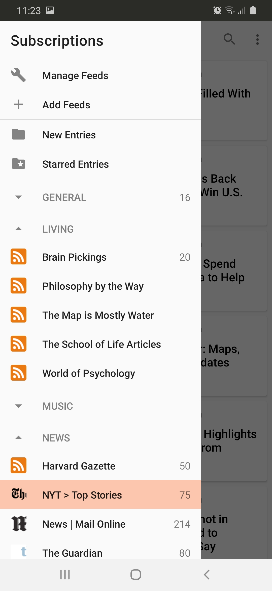
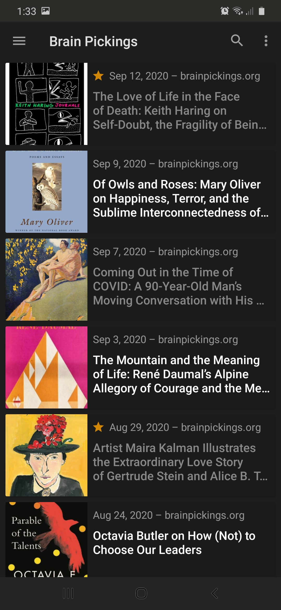
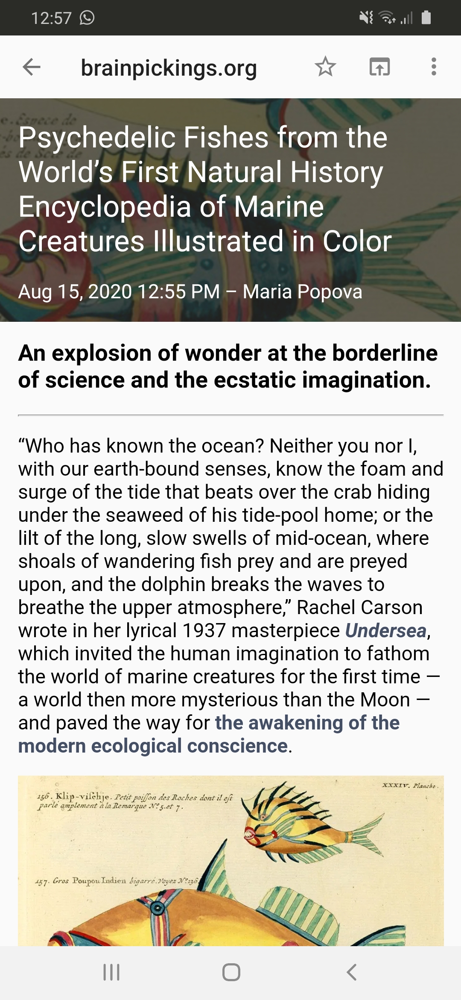

# NiceFeed
NiceFeed is an RSS Reader for Android. I wanted something to help me keep up with the news while learning Kotlin at the same time. RSS is an old technology and there are already many readers out there, but I find many of them clunky, hard to navigate, and jam-packed with features I don't need. The aim is an attractive and intuitive app, leightweight but fully functional with not too many frills.

<b>Early Access</b> 
NiceFeed is now in Beta and available on Google Play! I'm constantly updating this app and trying to make it better. I would truly appreciate any and all feedback, especially if you find any issues or bugs, or have ideas for new features. 

Some older screenshots that need to be updated:  
  

<h3>Features</h3>
<ul>
  <li>RSS parsing provided by <a href="https://github.com/prof18/RSS-Parser">RSS Parser</a></li>
  <li>Search engine powered by <a href="https://developer.feedly.com/v3/search/">Feedly Search API</a></li>
  <li>OPML support (importing and exporting) provided by <a href="https://github.com/rometools/rome">Rome Tools</a>
  <li>Ability to organize feeds by category</li>
  <li>Star/unstar and mark entries as read/unread</li>
</ul>
