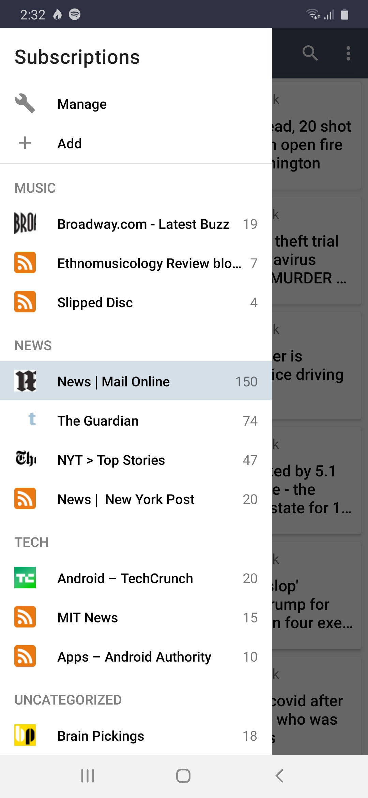
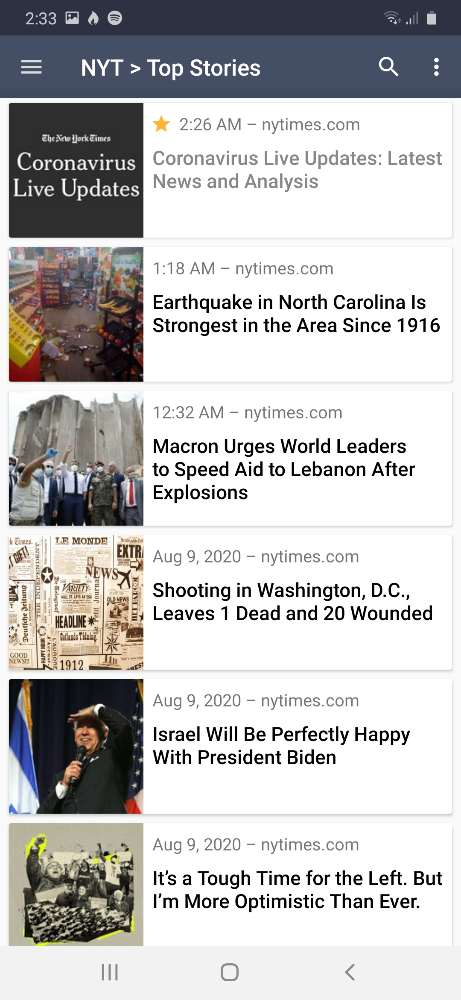

# NiceFeed
RSS Reader for Android; a personal project while learning Kotlin. Aiming for a nimble but fully functional app with good architecture and not too many frills. Stay tuned for releases.

  

<h3>Features</h3>
<ul>
  <li>RSS parsing provided by <a href="https://github.com/prof18/RSS-Parser">RSS Parser</a></li>
  <li>Search engine powered by <a href="https://developer.feedly.com/v3/search/">Feedly Search API</a></li>
  <li>OPML support provided by <a href="https://github.com/rometools/rome">Rome Tools</a>
  <li>Organize feeds by category</li>
  <li>Star/unstar and mark entries as read/unread</li>
</ul>
